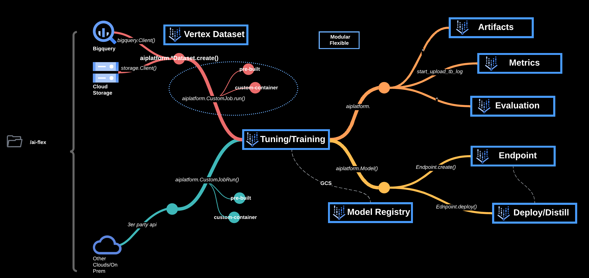

# Getting Started
All the steps are modular/flexible thereforer order is not important, variables.py is the file for setting the values.

## Training

Training code is under the folder */trainer*, this folder has 2 files: preprocess.py *"for feature engineering* and train.py *"for training"*.

```mermaid
graph TB
        A[Google Cloud Storage] ---> |train.csv| B[Tensor]
    subgraph  ""
        direction TB
        B -- "feature engineering" --> C[Normalization]
        B -- "feature engineering" --> D[Categorical Encoding]
        C --> E[Concatenation]
        D --> E
        E --> |training| F(Neural Network)
        id1{{aiplatform.CustomJob}}
    end
        F --> |model save| G[Google Cloud Storage]
```

### For custom containers
#### Build & Push Images

Container Images Sizes:
- cpu = 2.45GB
- gpu = 12.3GB

```sh
docker build -t us-central1-docker.pkg.dev/vtxdemos/custom-trains/tf-preprocess_cpu:1.0 -f Dockerfile\[CPU\] .
docker push us-central1-docker.pkg.dev/vtxdemos/custom-trains/tf-preprocess_cpu:1.0

docker build -t us-central1-docker.pkg.dev/vtxdemos/custom-trains/tf-preprocess_gpu:1.0 -f trainer/Dockerfile\[GPU\] .
docker push us-central1-docker.pkg.dev/vtxdemos/custom-trains/tf-preprocess_gpu:1.0
```

### For pre-built containers
#### Build Eggs or Python Distribution Packages and Copy to GCS
```sh
python setup.py sdist --formats=gztar
gsutil cp dist/trainer-0.1.tar.gz gs://vtxdemos-dist/ai-flex-train/trainer-0.1.tar.gz
```
### Run jobs

```sh
python CustomJob[*][*].py
```
*\*\* are file types: custom-container/prebuilt, cp/gpu*

## Prediction

Prediction code is under /inference which has 1 file "main.py", we ise fastapi + uvicorn as a web server to serve tensorflow model.

```mermaid
graph TB
        A[Google Cloud Storage] ---> |gs://vtxdemos-models/ecommerce/09-08-23/model/*| B(Model Registry)
    subgraph  Models
        direction TB
        B -- "model version" --> C(Deploy)
        id1([aiplatform.Model.upload])
    end
    subgraph "Endpoints"
        direction TB
        E(Endpoint Create)
        C --> |machine type, accelerator| D(Public Endpoint)
        E --> |machine type, accelerator| D(Public Endpoint)
        id2([aiplatform.Endpoint.create])
    end
```

### For custom containers
#### Build & Push Images

Container Images Sizes:
- cpu = 2.45GB

```sh
docker build -t us-central1-docker.pkg.dev/vtxdemos/custom-predictions/tf-preprocess_cpu:1.0 -f Dockerfile_prediction_[cpu] .
docker push us-central1-docker.pkg.dev/vtxdemos/custom-predictions/tf-preprocess_cpu:1.0

docker build -t us-central1-docker.pkg.dev/vtxdemos/custom-predictions/tf-preprocess_gpu:1.0 -f Dockerfile_prediction_[gpu] .
docker push us-central1-docker.pkg.dev/vtxdemos/custom-predictions/tf-preprocess_gpu:1.0
```

## Run Upload Jobs
```sh
python CustomJob[*][*].py
```
*\*\* are file types: custom-container/prebuilt, cp/gpu*

## Comments

We can also chain the calls/components like this and have them in 1 file:

```python

from variables import *
from google.cloud import aiplatform

aiplatform.init(project=project_id, location=region, staging_bucket=staging_bucket)

#region vertexai CustomJob
model = aiplatform.CustomJob(
    display_name=display_name_job+"-cpu",
    worker_pool_specs=[
        {
            "machine_spec": {
                "machine_type": machine_type_cpu,
                #"accelerator_type": accelerator_type,
                #"accelerator_count": accelerator_count,
            },
            "replica_count": replica_count,
            "container_spec": {
                "image_uri": custom_train_image_uri_cpu,
                "args": ["python", "-m", "trainer.train", "--dataset", dataset_uri]
            },
        },
    ],
    base_output_dir = model_uri,
    labels= {
        "ai-flex": "custom-train-cpu"
        }
)
model=model.run()
#endregion


#region vertexai Import to Model Registry and Deploy
model = aiplatform.Model.upload(
    display_name=display_name_job, 
    artifact_uri=model_uri, 
    serving_container_image_uri=custom_predict_image_uri_cpu
)

endpoint = aiplatform.Endpoint.create(
    display_name=display_name_job+"cpu", 
)

model.deploy(
    endpoint=endpoint, 
    traffic_split={"0": 100},
    machine_type=machine_type_cpu, 
    min_replica_count=1, 
    max_replica_count=1, 
    sync=True
)
```