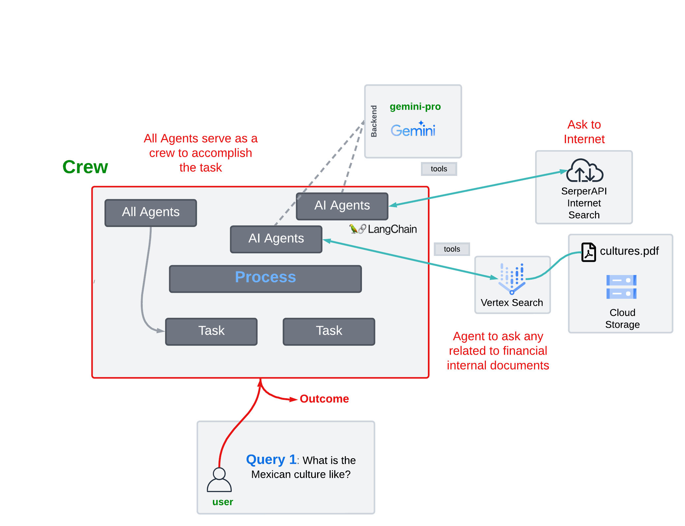
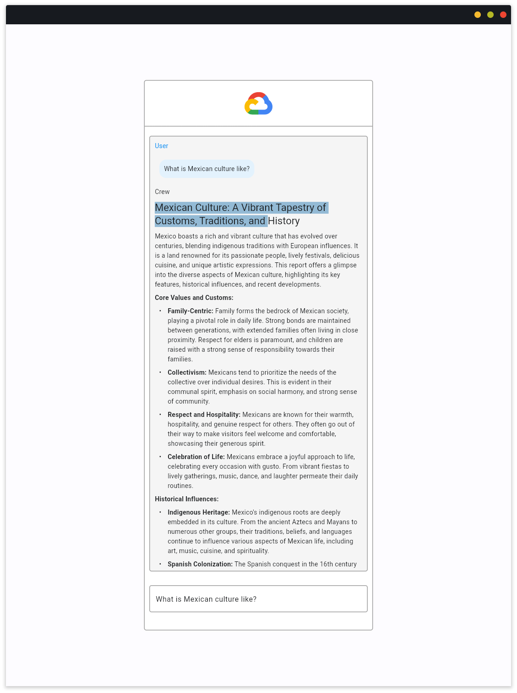

## CrewAI 

CrewAI is a platform to run AI Agents for frameworks that are complex,
the platform orchestrates role-playing, autonomouns AI agents, by fostering
collaboraite intelligence.

## Architecture




## Front End Presentation



## Prework

Install all the python packages required to run this script:

```bash
pip install -r requirements.txt
```

Use the [getting started guide](https://cloud.google.com/generative-ai-app-builder/docs/try-enterprise-search) to create a RAG with Vertex Search.

## Components Used
- [Vertex Gemini 1.0](https://cloud.google.com/vertex-ai?hl=en)
- [Vertex Search](https://cloud.google.com/enterprise-search?hl=en)
- [CrewAI](https://www.crewai.com/)
- [Langchain (for tooling)](https://www.langchain.com/)
- [Flet (Python Front End Framework)](https://flet.dev/)

## Using the script

```bash
flet run crewai.py
```

## Results

```markdown
Mexico boasts a rich and vibrant culture that has evolved over centuries, blending indigenous traditions with European influences. It is a land renowned for its passionate people, lively festivals, delicious cuisine, and unique artistic expressions. This report offers a glimpse into the diverse aspects of Mexican culture, highlighting its key features, historical influences, and recent developments.

**Core Values and Customs:**

* **Family-Centric:** Family forms the bedrock of Mexican society, playing a pivotal role in daily life. Strong bonds are maintained between generations, with extended families often living in close proximity. Respect for elders is paramount, and children are raised with a strong sense of responsibility towards their families.
* **Collectivism:** Mexicans tend to prioritize the needs of the collective over individual desires. This is evident in their communal spirit, emphasis on social harmony, and strong sense of community.
* **Respect and Hospitality:** Mexicans are known for their warmth, hospitality, and genuine respect for others. They often go out of their way to make visitors feel welcome and comfortable, showcasing their generous spirit.
* **Celebration of Life:** Mexicans embrace a joyful approach to life, celebrating every occasion with gusto. From vibrant fiestas to lively gatherings, music, dance, and laughter permeate their daily routines.

**Historical Influences:**

* **Indigenous Heritage:** Mexico's indigenous roots are deeply embedded in its culture. From the ancient Aztecs and Mayans to numerous other groups, their traditions, beliefs, and languages continue to influence various aspects of Mexican life, including art, music, cuisine, and spirituality.
* **Spanish Colonization:** The Spanish conquest in the 16th century left an undeniable mark on Mexican culture. Spanish language, religion, and architectural styles became integrated into the existing indigenous practices, creating a unique blend.
* **Global Influences:** Over time, Mexico has absorbed elements from other cultures, including African and Asian influences, enriching its cultural tapestry further.

**Recent Developments:**

* **Modernization:** Mexico has witnessed significant modernization in recent years, particularly in urban areas. This has led to changes in lifestyle, technology adoption, and increased exposure to global trends. However, traditional values and customs continue to hold strong alongside these advancements.
* **Cultural Preservation:** There is a growing awareness and appreciation for preserving Mexican cultural heritage. Efforts are underway to safeguard traditional art forms, languages, and customs, ensuring their continuity for future generations.
* **Diaspora Influence:** The Mexican diaspora has played a crucial role in disseminating aspects of Mexican culture worldwide. From traditional cuisine and music to artistic expressions and cultural events, Mexican communities abroad contribute to the global understanding and appreciation of their rich heritage.

**Conclusion:**

Mexican culture is a dynamic and multifaceted entity, constantly evolving while preserving its core values. Its vibrant traditions, historical influences, and recent developments create a unique and fascinating cultural landscape. As Mexico continues to navigate the modern world, its cultural heritage remains a vital source of identity, pride, and inspiration for its people.

**Additional Findings:**

* Recent research suggests that cultural factors like collectivism and family orientation contribute to Mexicans' higher levels of subjective well-being.
* The Mexican government has implemented initiatives to promote cultural diversity and inclusion, recognizing the value of its rich heritage.
* Mexican artists, musicians, and filmmakers are increasingly gaining international recognition, showcasing the country's vibrant creative scene.

This report provides a starting point for exploring the vast and captivating world of Mexican culture. With its rich history, diverse customs, and dynamic expressions, Mexico continues to captivate and inspire audiences worldwide.
```

## Logs

**Action: Search external (internet)**

**Action: Search internal**
```markdown
**Action: Search external (internet)**
Action Input: {"query": "What is Mexican culture like?"}

Title: Mexican culture: Customs and traditions | Live Science
Link: https://www.livescience.com/38647-mexican-culture.html
Snippet: Mexican business culture tends to value personal relationships, a strong hierarchy and a clear consciousness of status, according to Santander.

-----------------
Title: A Brief Introduction To Mexican Culture - 24 Hour Translation Services
Link: https://www.24hourtranslation.com/a-brief-introduction-to-mexican-culture.html
Snippet: Mexico is a land of vibrant culture, fascinating history, and warm, hospitable people. This country is home to one of the world's richest ...

-----------------
Title: How to describe Mexican culture in comparison to your culture - Quora
Link: https://www.quora.com/How-do-you-describe-Mexican-culture-in-comparison-to-your-culture
Snippet: I would describe Mexican culture as being very passionate, family-oriented, and festive. In comparison to my own culture, I would say that ...

-----------------
Title: What are some peculiarities of Mexican culture which are not easily ...
Link: https://www.reddit.com/r/AskReddit/comments/oska1l/what_are_some_peculiarities_of_mexican_culture/
Snippet: The way a Mexican-born family friend one explained it, Mexicans are culturally a very present-oriented people. They're not given to reminiscing ...

-----------------

Thought: I have gathered information from external sources about the various aspects of Mexican culture.

**Action: Search internal**

Action Input: {"query": "how has mexican culture changed in recent years?"}


The National Cathedral in Mexico City, which sits upon the ancient city of Tenochtitlan. The dominant religion in Mexico is
Roman Catholicism.

ships in 1970 and 1986—an accomplishment
achieved otherwise only by rich countries such as
France and Italy.
The development of Mexican national identity
has also focused on Mexico’s distinctive relationship
to the United States. U.S. economic and cultural
influence in Mexico is strong. Mexicans resent this
situation but at the same time admire the achieve
ments of their northern neighbors.
Internally, the forging of a national identity al
ways revolved around the issue of race. The adop
tion of liberalism in the nineteenth century implied
that all racial groups in Mexico were made legally
equal in the framework of the incipient nation
state, although not in social practice. The dominant
ideology actively sought to eliminate racial hetero
geneity. It was believed that only a racially homo
geneous population could develop a national iden
tity, which led to the promotion of racial mixing, or
mestizaje.
After the revolution, the emphasis shifted from
racial to cultural differences. The value ascribed to
Mexico’s indigenous peoples also changed. The
grandeur of pre-Columbian Indian culture was in
corporated into the national imagery. At the same
time, the ideas and policies that stressed cultural
uniformity and homogeneity persisted. In the ideol

ogy of the revolution, the opposition between In
dian and European had given rise to a synthesis, the
mestizo, who was considered the authentic Mexican.
In the middle of the twentieth century, the elabora
tion of the national identity increasingly concen
trated on the supposed (psychological) character of
the quintessential Mexican mestizo. This gave rise
to the mythology of mexicanidad, or ‘‘the essence of
being Mexican.’’
In recent years, the ideas about Mexican na
tional identity have again changed. Although the
absolute majority of the population is mestizo,
there is a renewed attention to and appreciation of
cultural differences and diversity. The rethinking of
the role and meaning of indigenous peoples has
given rise to the notion of a pluricultural national
identity.
Ethnic Relations. Social policies aimed at the
emancipation of Indian groups and the elimination
of profound socioeconomic inequalities have been
employed since the 1930s. Nevertheless, indigenous
populations are among the poorest and most mar
ginalized groups in Mexico. Prejudice among broad
sectors of the population toward Indians persists.
Elites in provincial towns in predominantly indige
nous regions are often openly racist. This situation

MEXICO

1450Scenic view of downtown Mexico City, Mexico. All major highways in Mexico converge in the capital city.

guards. At the same time, conspicuous consump
tion and grandeur is an important characteristic of
Mexican culture. A prominent medium is the pos
session of new and expensive cars. Members of the
lower middle class put in great financial effort to
demonstrate to the outside world their aspirations,
sometimes to the detriment of elementary needs.
Wealthy people dress elegantly according to in
ternational clothing standards and wear expensive
watches and jewelry. Dress codes are very strict in
Mexico, especially at work and school. In primary
and secondary school, students wear uniforms.
Since colonial times, the use of sandals has been
associated with the countryside, poverty, and In
dians.
An important cultural marker of class differ
ence is access to all sorts of private facilities.
Whereas wealthy people and members of the upper
middle class send their children to private schools
and universities, use private means of transporta
tion, and go to private hospitals and sports clubs,
the not-so well-off make use of crowded state
subsidized facilities.
Class differences are also confirmed in certain
behavioral rules. One such rule involves the ritual of
waiting that a person from a lower position in the
social hierarchy has to endure when seeking access
to someone at a higher level. When class differences

coincide with ethnic distinctions, discriminatory
practices are not unusual.

POLITICAL LIFE
Government. Mexico is a federal republic—hence
its official name Estados Unidos Mexicanos—
operating under a centralized government. Govern
mental powers at the federal level are divided be
tween executive, legislative, and judicial branches,
but in political practice the executive, that is, the
presidency, has had strong control over the legisla
tive branch. Only in recent years has the legislative
branch seen its power increase because of the
strengthening of the multiparty system. The presi
dent is elected by popular vote for a six-year period
and is both the chief of state and head of govern
ment. The president appoints cabinet members. The
legislative branch is a bicameral National Congress
consisting of the Chamber of Deputies and the Sen
ate. The Chamber of Deputies has five hundred
members, elected for three-year terms; the Senate
has 128 members, elected for six-year terms. In the
judicial branch the Supreme Court of Justice is the
highest tribunal.
The federation is made up of thirty-one states
and the Federal District (the capital). Each state has a
governor, who serves a six-year term, and a un

MEXICO

1454


```